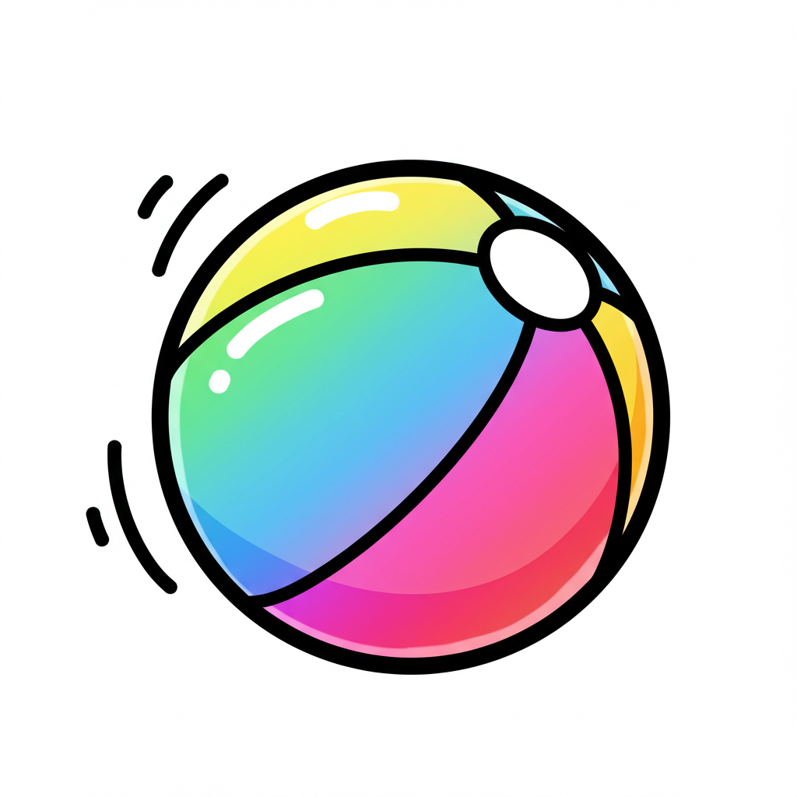

# 彩球弹跳模拟

[English](README_EN.md) | 中文

一个基于Flutter开发的3D彩球弹跳物理模拟应用，提供沉浸式的视觉体验和可交互的物理参数控制。

## 功能特点

- **3D物理模拟**：真实的物理引擎模拟，包括重力、弹性碰撞和速度衰减
- **动态彩球**：最多可同时模拟200个具有随机颜色和大小的彩球
- **实时参数调整**：通过直观的控制面板调整物理参数
  - 重力强度
  - 弹性系数
  - 速度衰减
  - 粒子数量
- **视觉特效**：
  - 彩球轨迹跟踪
  - 碰撞特效和发光效果
  - 3D旋转视角
  - 霓虹风格的UI设计

## 技术实现

- 使用Flutter自定义绘制(CustomPainter)实现3D渲染
- 基于vector_math库进行3D数学计算和矩阵变换
- 实现了基于时间的物理模拟系统
- 采用面向对象设计，将球体、容器和控制面板分离
- 使用随机颜色生成和渐变效果增强视觉体验

## 项目结构

- **main.dart**: 应用入口和主题配置
- **ball.dart**: 球体类定义，包含位置、速度、颜色等属性和碰撞检测逻辑
- **ball_container.dart**: 球体容器和渲染逻辑，包含物理模拟和3D变换
- **control_panel.dart**: 用户交互控制面板，用于调整物理参数

## 如何使用

1. 启动应用后，您将看到一个3D球形容器中的彩色小球
2. 使用右下角的控制面板调整物理参数：
   - 调整重力可以改变小球的下落速度
   - 调整弹性系数可以改变小球碰撞后的反弹程度
   - 调整速度衰减可以模拟不同的摩擦环境
   - 调整粒子数量可以增加或减少模拟的小球数量
3. 欣赏炫彩的视觉效果和流畅的物理模拟

## 依赖项

- Flutter SDK: ^3.7.0
- vector_math: ^2.1.4 - 用于3D数学计算
- random_color: ^1.0.6-nullsafety - 用于生成随机颜色
- sensors_plus: ^4.0.2 - 用于传感器交互
- flutter_gl: ^0.0.21 - 用于图形渲染

## 开发环境配置

1. 确保已安装Flutter SDK
2. 克隆此仓库
3. 运行 `flutter pub get` 安装依赖
4. 使用 `flutter run` 启动应用

## 未来计划

- 添加更多物理参数控制
- 实现多种预设场景
- 添加触摸交互功能
- 支持更多平台
