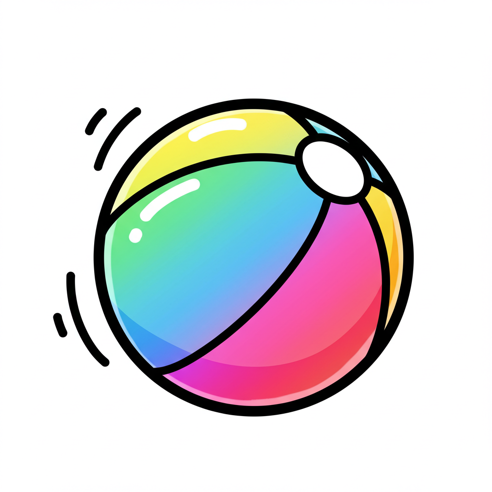

# Colorful Ball Bounce Simulation

[English](README_EN.md) | [中文](README.md)

A 3D colorful ball bounce physics simulation application developed with Flutter, providing an immersive visual experience and interactive physics parameter controls.

## Features

- **3D Physics Simulation**: Realistic physics engine simulation, including gravity, elastic collisions, and velocity decay
- **Dynamic Colorful Balls**: Simultaneously simulate up to 200 balls with random colors and sizes
- **Real-time Parameter Adjustment**: Adjust physics parameters through an intuitive control panel
  - Gravity strength
  - Elasticity coefficient
  - Velocity decay
  - Particle count
- **Visual Effects**:
  - Ball trajectory tracking
  - Collision effects and glow effects
  - 3D rotating perspective
  - Neon-style UI design

## Technical Implementation

- Using Flutter custom painting (CustomPainter) for 3D rendering
- 3D mathematical calculations and matrix transformations based on vector_math library
- Implementation of a time-based physics simulation system
- Object-oriented design, separating balls, container, and control panel
- Enhanced visual experience with random color generation and gradient effects

## Project Structure

- **main.dart**: Application entry and theme configuration
- **ball.dart**: Ball class definition, including position, velocity, color, and collision detection logic
- **ball_container.dart**: Ball container and rendering logic, including physics simulation and 3D transformations
- **control_panel.dart**: User interaction control panel for adjusting physics parameters

## How to Use

1. After launching the application, you will see colorful balls in a 3D spherical container
2. Use the control panel in the bottom right corner to adjust physics parameters:
   - Adjust gravity to change the falling speed of the balls
   - Adjust elasticity coefficient to change the rebound degree after ball collision
   - Adjust velocity decay to simulate different friction environments
   - Adjust particle count to increase or decrease the number of simulated balls
3. Enjoy the colorful visual effects and smooth physics simulation

## Dependencies

- Flutter SDK: ^3.7.0
- vector_math: ^2.1.4 - For 3D mathematical calculations
- random_color: ^1.0.6-nullsafety - For generating random colors
- sensors_plus: ^4.0.2 - For sensor interaction
- flutter_gl: ^0.0.21 - For graphics rendering

## Development Environment Setup

1. Ensure Flutter SDK is installed
2. Clone this repository
3. Run `flutter pub get` to install dependencies
4. Use `flutter run` to launch the application

## Future Plans

- Add more physics parameter controls
- Implement multiple preset scenes
- Add touch interaction functionality
- Support more platforms